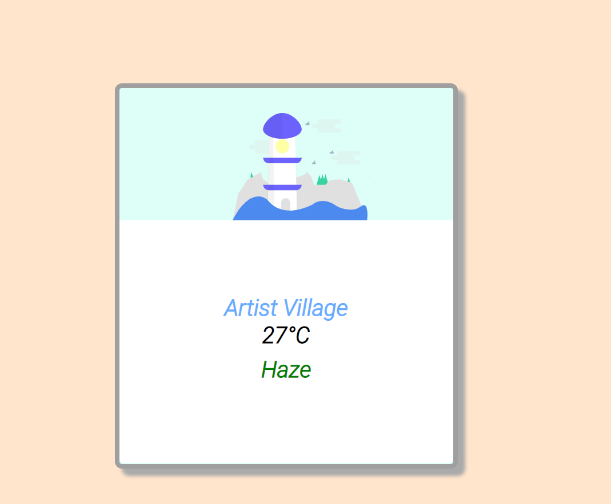

# Weather app

This is an application which showcases live weather where you are currently based on. The application uses openWeatherMap api to showcase the temperature and the place.

# The procedure to run the app

Open `index.html` or use live server or lite server, or any other serving service to serve the files and view the index.html file, you will see the results.

<strong><a href="https://zaidajani.github.io/weather-app/" target="_blank">Click here</a> to see demo of the app</strong>



# The important part

There are two important parts in the application, `css` and `javascript`.

The major one is javascript, and the fetch function in javascript, the documentation is right down.

```javascript

  function getFromAnApi(apiKey) {
    fetch(apiKey)
      .then(res => res.json())
      .then(data => {
        console.log(data.main);
      });
      // fetch function works asynchronusly
  }

```
Above given is the example of fetch function, from an api key, to putting the results in the console.

hope this helps.

<b>Enjoy your powerfull app</b>
